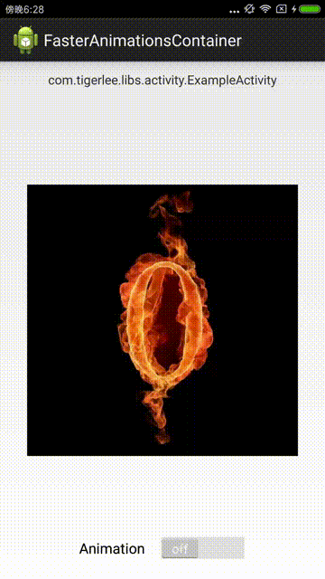

# Mock Frame Animation | [中文](index-zh)

MockFrameAnimation can help to avoid OutOfMemoryError when playing frame animation.
It loads an image on background thread with global bitmap cache.

As we known, Android loads all the drawables at once for any frame animations, so animation with 
many frames causes OutOfMemoryError easily. 

# How to use

```java
int ANIMATION_INTERVAL = 120;// 200ms
int[] IMAGE_RESOURCES = {
    R.drawable.num_0,
    R.drawable.num_1,
    R.drawable.num_2,
    // ...
    R.drawable.num_e,
    R.drawable.num_f,
};

ImageView imageView = (ImageView) findViewById(R.id.imageview);
MockFrameAnimation animation = new MockFrameAnimation(IMAGE_RESOURCES.length)
    .with(IMAGE_RESOURCES, ANIMATION_INTERVAL)
    .into(imageView);
animation.start();
// stop animation when necessary such as onDestroy
// animation.stop();

```



# Optimization
The standard android frame animation is more suit for small animations with less images, so it 
won't lead to OutOfMemoryError while keep the animation fluent; As to MockFrameAnimation, we decode 
image dynamically and exert as little pressure as possible on system memory. These can increase the
 pressure on CPU, so we allow developer to set the cache size for the new balance between memory and
 CPU. The more we cache, the less we need to decode.

This project is fork from [FasterAnimationsContainer](https://github.com/tigerjj/FasterAnimationsContainer);
Since the original project seems no longer maintained actively and there are some issues 
need to be fixed before it can be used. We've send [Pull Request](https://github.com/tigerjj/FasterAnimationsContainer/issues/11)
 and fixed these issues in MockFrameAnimation.
 
The mainly changes we've done:

1. fix warning when reuse bitmap with option.in;
2. fix animation frozen issue after Home press
3. FasterAnimationsContainer is no longer singleton, so each ImageView may control it's animation;
4. global bitmap cache supported;

# License

```
Licensed under the Apache License, Version 2.0 (the "License");
you may not use this file except in compliance with the License.
You may obtain a copy of the License at

   http://www.apache.org/licenses/LICENSE-2.0

Unless required by applicable law or agreed to in writing, software
distributed under the License is distributed on an "AS IS" BASIS,
WITHOUT WARRANTIES OR CONDITIONS OF ANY KIND, either express or implied.
See the License for the specific language governing permissions and
limitations under the License.
```
